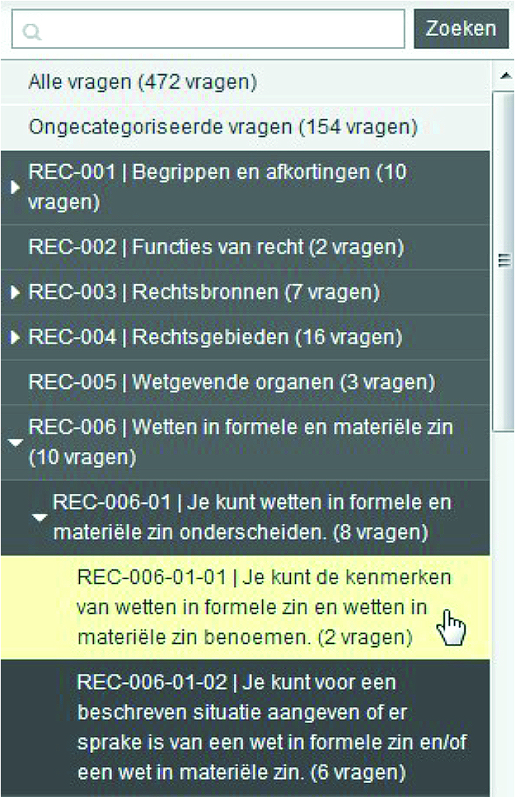

# Going deeper

## Why create an item bank? And why collaborate?

You describe the purpose of the item bank in the preparatory phase. In this chapter, we describe a number of possible ways in which an item bank can have an impact on teaching. We will also elaborate on the benefits of collaborating on an item bank. Finally, we will examine which factors within the professional field contribute to a successful joint item bank project.

### Why create an item bank?

Decide what role the item bank will play in the learning and assessment process. An item bank is often created with the aim of having an impact on education, such as improving quality or increasing efficiency.

Examples of the intended impact are:

* *Psychometric*: increasing the reliability and validity of tests.
* *Accountability and transparency*: the launch of the item bank will provide more opportunities to account for the quality of assessment in a transparent manner. For instance, it will provide a good view of the entire item bank and the match with the test matrix.
* *Assurance*: a more verifiable and less error-prone production process of items, for example, by verifiable version management of items.
* *Sustainability*: items are managed within the item bank independently of a specific lecturer. So they will not disappear when a teacher leaves.
** Test security** it is easy to produce multiple test versions and therefore prevent cheating.
** Test security** it becomes easier to develop tests in a secure way, for example, because items are no longer forwarded through email systems.
* *Efficiency*: reusing items reduces costs. Items only need to be typed once, editing and improvement can be performed much faster, and items can be more easily selected for inclusion in a test.
* *Educational quality*: reusing items allows lecturers to spend more time teaching.
* *Educational quality*: there will be more practice opportunities and opportunities for level differentiation.
* *Educational quality*: resits and better feedback opportunities can be organised more quickly.
* *Educational quality*: the study success rate will be higher, as students will be able to practice and internalise the subject matter better.
* *Utility*: investments in items that have already developed are more effectively recouped.

### Why create an item bank? And why collaborate?

There is a lot to be gained from collaboration, both within and between institutions. The joint creation and use of item banks can even lead to a significant qualitative and quantitative benefit in the short term. Why?

Firstly, lecturers who jointly set up an item bank will have to enter into a dialogue based on clear terms. They decide together how they will talk about item development and what minimum quality requirements they set. This already helps to raise the standard of quality.

Secondly, the use of assessment experts in the collaboration is self-evident. They can contribute to the assessment content but also, for example, in the field of test competence, editing and layout. This will also help improve the quality of the items. See **[§ 3.7.2](#hoe-realiseer-je-een-kwaliteitsverbetering)** about the various roles in item development.

Thirdly, when you collaborate, you will agree more rules about the item development process. This means that the item developers will become more aware of the various development phases, the responsibility and assurances in the process. If item developers adhere to these rules, this will lead to an increase in quality. This will allow for better control of quality because the process is assured.

Finally, collaboration can lead to lower costs. Initially, collaborating will entail more costs, but once developed items are used more often and by more lecturers – and therefore used by more students – the cost of use of the items will reduce on balance. For a further explanation, see **[Hoofdstuk 3.4](#kosten-en-baten)**.

### Potential fields for successful collaboration

A shared vision within the field of study could help you achieve a successful item bank more quickly. The more people within a given field agree on the classification of the subject matter, the more self-evident it will become to develop item banks together. Fields of study with a common body of knowledge (BoK), such as teacher training programmes or the medical field, are good examples of this. Subject areas in which most study programmes provide introductory courses are also suitable for organising joint item banks. Examples include Introduction to Psychology, Introduction to Sociology, Introduction to Neurobiology, and Introduction to Programming.

Stable domains lend themselves well to joint item banks that can be set up with little maintenance. Classical subjects such as logic, mathematics, statistics, mechanics, accounting and the fundamentals of microbiology lend themselves well to such collaboration. Once developed, questions will stay fresh for a long time. For disciplines that are constantly developing thanks to new understanding, it will be important to maintain items. Outdated or obsolete items must be identified and deleted or updated. This process must be structured systematically in order to ensure the quality of the questionnaire. For instance, a yearly review of all items to check for freshness. When you collaborate with others, it is essential to agree who will do this and when. Examples of subject areas to which this applies are the medical field, nursing, tourism and history. Collaboration to share costs and increase quality is an interesting driver here.

Subject areas that are constantly developing in terms of content (volatile domains) require an even stronger focus on the design of the item bank system and the assurance process. Think of subjects where recent legislation is always important, such as Law, where adaptation to new protocols is always happening, such as Nursing, or where work is largely thematic. Ongoing attention is required for screening, editing, deletion or supplementation. A process has to be established to deal with this.

In subject areas in which large numbers of students are taught, item banks are also more suitable for collaboration, because the investment costs and maintenance costs per student will then be much lower.

## Technology: Systems

You will conduct research into the item bank system to be used when preparing the project. In the case of a small project, this will probably be the institution's central assessment system. Find out within the institution which department is responsible for managing educative ICT applications and, in particular, assessment systems, and discuss your wants and needs for the item bank.

First and foremost, item bank systems must facilitate:

* proper entry and organisation of items, as well as search and selection
* activities relating to quality assurance of the items.

Assessment systems come in many types and sizes and offer many features that meet these requirements.

The core components of a digital assessment system are the authoring environment, the item bank, the playback environment and the analysis tool. In **[Hoofdstuk 3.5](#organisatie-processtappen-rollen-en-rechten)**, we will take a deeper dive into the underlying processes of these components.

### Commonly used assessment systems in education

This section provides a run-down of the most commonly used assessment systems in higher education. The list has been compiled by experts involved in the authoring of this manual. The market for assessment system suppliers is dynamic, and for this reason the list is incomplete.**Commonly used assessment systems in the Netherlands:**

* [TestVision](http://www.testvision.nl)
* [RemindoToets](https://www.paragin.nl/remindotoets/)
* [MapleTA](https://www.maplesoft.com/products/mapleta/)
* [Cirrus Assessment](http://www.cirrusassessment.com/)
* [QM](http://www.questionmark.com)
* [iQualify](www.infoland.nl/producten/iqualify)
* [Ans Delft](https://secure.ans-delft.nl/ Quiz-/)

**Assessment systems within Learning Management Systems with limited item bank functionality:**

* [Canvas](https://www.canvaslms.com/)
* [Blackboard](http://www.blackboard.com)
* [Desire2Learn BrightSpace](https://www.d2l.com/products/learning-environment/)
* [Moodle](https://moodle.com/)
* [Cumlaude](https://www.cumlaudelearning.com/)

**Item bank systems (stand-alone programs) with direct item export functionality:**

* [Respondus](https://www.respondus.com/)
* [ExamView](https://www.turningtechnologies.com/examview)

**Assessment systems with questions:**

* [SOWISO (Mathematics)](https://sowiso.nl/nl/)
* [Grasple (Statistics)](https://www.grasple.com/)
* [Zeer Actieve Psychologie](http://zap.psy.utwente.nl/)
* [R/Exams (Statistics)](http://www.r-exams.org/)
* [Drillster](https://www.drillster.com/info/)
* [Quizlet](https://quizlet.com/)
* [ProProfs](https://www.proprofs.com/)
* Item banks by publishing houses, often corresponding to a specific textbook or online learning environment (e.g. [Pearson MyLab series](https://mlm.pearson.com/), (McGraw Hill methods, WebAssign etc.)

::::

### Sharing test items between systems

Not every educational institution in the Netherlands uses the same assessment software.

So how can you still collaborate on item banks? It is often possible to convert simple multiple-choice questions from one system to another. For example, institution A creates the questions and institutions B and C convert them for use in their own assessment system. Ideally, however, you will work in the same authoring environment, follow a joint item development process, and all the questions and data about the created items will flow back to a single item bank.

#### QTI Standard

In recent years, research has been carried out in SURF's own network into interoperability and the ability to share questions between the various systems. At the international level, development of the IMS QTI standard (Question and Test Interoperability)(https://www.imsglobal.org/question/index.html) is ongoing. This standard will not solve all interchange issues in the short term, because some systems have question types that others do not, such as pointing to multiple points in an image or unequal matching questions. At the same time, QTI already works in many cases for multiple-choice tests. In practice, therefore, a more complex collaborative venture between multiple institutions means that most of the participating partners would have to work in a system other than their home system.

If you cannot work in a single item bank system during the collaboration, limit the question type to be used to the multiple-choice question. This form is so simple that exchange via QTI or plain text usually runs without a hitch. Assume that metadata and media (images, sound) will not transfer well with you when you export or import items.

During the preparation, perform an item interchange test. This will allow you to establish whether the transfer is working or whether conversion tools need to be created. Try to use the same system wherever possible, even when working across multiple institutions.

#### LTI and SCORM standard

Assessment professionals often use the IMS LTI (Learning Tools Interoperability) standard and SCORM (Sharable Content Object Reference Model) standards. However, these are not item interchange standards. These standards are used to link assessment systems to other systems, such as learning management systems (such as Blackboard or Canvas).

Lecturer and student data, in particular, is automatically exchanged between the systems, assessments can be initiated from the LMS, and the test scores are fed back to the grading functions of the LMS. This creates a more distinctive experience of the LMS for the end-users and they do not need any extra logins.

### Security and scalability of item banks

Summative items, in particular, must be developed and stored in item banks in secure conditions. The greater the importance of the tests, the more thought needs to be given to security.

You also want to prevent the distribution of items during the administration of exams, especially where questions have been calibrated and item banks are small. When administrating exams by computer, it is important to use a protected environment (secure browser), but also to check carefully for mobile phones, glasses, watches and other devices that may be able to take pictures of the screen or paper. Professional invigilators remain necessary.

At the same time, during the coronavirus period of 2020-2021, a huge leap was made in administrating exams and tests using online invigilation (also widely known as online proctoring). Online proctoring allows students to be monitored remotely by collecting images of the student – using his or her webcam – and of the screen.

For more information, see SURF's publication [Secure Assessment Workbook](https://www.surf.nl/en/secure-assessment-workbook-tools-and-tips-for-setting-up-a-secure-assessment-proces).

Scalability is closely related to the desired size of the item bank. Be sure to consider the addition of any external authors, the performance of the authoring environment, the possible growth of the number of questions and subjects to be added, and metadata.

## Item bank size

How do you decide on the number of items in an item bank? During the preparation, you will already be giving some thought to the required size, because this will give you some idea of the amount of time and the resources you will need to create the item bank. Sometimes impressive numbers of items are quoted, but the required size actually depends on many factors.

First of all, you will need to know how many items you want to include in a test. Can you and are you allowed to reuse items? Do you want to use the items in a summative or formative test? This can make a difference for the required number.

In the sections below, we outline scenarios for various tests in which you might want to use the items.

### Summative tests conducted simultaneously for all students

Most tests in higher education are conducted as classical examinations. One lecturer or team puts together a test for a group of candidates for one course from a single institution. All students sit the exam at the same time. What will the situation be then?

| Test questions released      | Test questions not released |
| ----------- | ----------- |
| Let's say that the test questions will be released following the test, that you compile three different versions of the test and that the test consists of fifty items. In that case, you will need an item bank whose size will have to increase by 150 items for each test. After five years, there will be 750 items in the item bank. Institutions often stipulate in their assessment policy the rules relating to what is and what is not permitted with regard to the reuse of items.      | Let's say that the test questions will not be released following the test, that you compile three different versions of the test and that the test consists of fifty items. In this case, an item bank of 150 items will be sufficient.       |
| Let's say that the test questions will be released following the test, that the position of a question in the test is randomly selected from one of two positions, and that the test consists of fifty items. In that case, you will need an item bank whose size will have to increase by 100 items for each test. After five years, you will have an item bank of 500 items [@draaijer2015practical].   | Let's say that the test questions will not be released following the test, that the position of each question in the test is randomly selected from one of two positions, and that the test consists of fifty items. In this case, an item bank of 100 items will be sufficient.        |


### Summative tests that can be taken at any time

There are also tests that are administered whenever requested by the student. Here, there is a risk that students will collect items and share them among their peers. Or that students will enrol for the test multiple times in the hope of answering the same items to which they then know the correct answer.

Some people argue that it is not necessarily a bad thing if test questions are known, as long as the item bank is large enough. The reasoning is that if students can practice using all the items, they will learn the subject matter by themselves. However, there will always be a type of student who will try to memorise the correct answers so that no real knowledge or understanding is acquired. If they pass this test, it will impair the validity of the test. How many items are needed to prevent this is impossible to ascertain. Nevertheless, item banks holding at least 1,000 to 2,000 items would seem necessary.

In all cases, it is advisable to make sure that students answer new questions. A minimal variant is that alternatives from multiple-choice questions do vary in terms of content or their position in the test. In addition, parameterised test items could be used. These are questions in which numbers, objects or concepts are drawn from a collection [@fattoh2014automatic].

:::{.tip}

At the start of the Dutch Open University's item bank project, the guideline in use was that there should be fifteen times as many items in the bank as the number of items in a test. This requirement comes from the three examination opportunities per year and the assumption that students would complete the study programme within five years. 

For lecturers, it was almost impossible to create so many items, although about fifty item banks managed to succeed in doing so. The OU had the software modified so that students could only be presented with the same item again after five times. This made it possible to reduce the requirement of fifteen times to six times, which was a relief for the lecturers. 

Another requirement was that the item bank would be able to produce valuable psychometric analyses after one year. This would mean that each item would have to be answered at least thirty times. For some item banks, however, the requirement of fifteen times was already far too high; for example, when only ten students sat the exam for a particular specialisation on an annual basis.

::::

### Formative diagnostic tests

Formative diagnostic tests that represent the classical examination correspond to the sitting one to three representative one-off tests. In this case, it does not matter if the test questions are leaked. The reason being that it is the student's own responsibility to take a diagnostic test seriously or not.

If the idea is that students can sit a diagnostic test very frequently, the most sensible choice seems to be to determine how many tests like this you want to offer. If two are available, students will usually check the first one at the beginning of the semester to assess the desired learning outcomes, and the second one just before the summative examination to perform a self-check of whether they have mastered enough of the subject matter. The number of items required for summative tests that can be administered at any time is not relevant here.

### Formative practice tests

Formative practice tests require fewer items for each topic. First and foremost, the student will need good instructional items on key, difficult topics. For each topic, twenty or so items will probably suffice. If a subject area consists of twenty topics, approximately 400 items will then be required.

## Costs and benefits

During the preparation, you will assess the financial feasibility of your project. You will make an overall estimate of the expected investment in the item bank in terms of investment costs and running costs. In addition, you will assess the quantitative and qualitative advantages or benefits that the item bank may provide. You will try to find answers to the questions ‘why invest in an item bank? ’and ‘do the benefits outweigh the costs?’. Performing a cost-benefit analysis will help you find the answers to these questions. In the case of large investment plans, a business case is something that is increasingly being requested. A business case answers the question ‘why do we actually want this?’. It underpins future decisions and helps everyone to understand why the project is important.

The development of item banks can form part of a larger digital assessment implementation process within an institution. This will often be based on a business case. The costs and benefits of a proposed item bank will form one of the components of the business case. 9 For more information on the business case, see the publication [Theme edition: Testing and question banks in education, Jan 2017](https://www.surf.nl/en/theme-edition-testing-and-question-banks-in-education) (chapter on Costs and Benefits of an Item Bank, page 12; only available in Dutch).

### Costs

Developing an item bank will require an investment. These are the project costs. Subsequently, you will need money for running costs and for ongoing development and administration.

#### Project costs

The initial investment consists of creating a collaborative venture group, developing a plan, creating the organisation, consulting and negotiating on the structure of the item bank and its working methods, licencing and organising the administration of an item bank system, developing an initial number of items for the item bank and conducting the first tests using the items contained in the item bank.

Different time budgets are used for the development of items. For simple knowledge questions in a multiple-choice format, especially if it is also easy to formulate distractors, it may sometimes be possible to develop four items per hour. Questions concerning case studies or application usually take more time to develop, up to an average of 60 minutes per question. This time can increase if an item also needs accompanying audiovisual material and feedback.

If questions are to be used more than once, it is wise to review the quality after their first deployment in a test. Experience shows that after the first deployment, as many as half of the items will need to be modified. This can be a textual modification or may concern the subject matter itself. In the progress test for medical students, the development of a single item involves a large number of people. Despite this thoroughness, about one percent of the items are later found to be sub-standard in terms of content.

To keep track of costs, log the hours of the project team members and multiply the total hours by their hourly rate. Include costs of external hires too, as well as the cost of resources used (such as systems, rooms, travel expenses, training, materials). Also include an amount for contingencies, which you can substantiate by referencing potential risks.

A number of opportunities to finance the development of more complex item banks:

* ‘Closed exchanges’ are used for the development of the item banks. Decide who will create and review how many items and the time periods for doing so. No invoices will be sent between the team members.
* Item developers receive a fee per constructed and approved item. As a result, it will not matter which lecturer or institution creates the most items. In this case, however, out-of-pocket expenses will have to be available to fund item developers.
* The coordinating institution or lecturer will receive a separate fee because the coordinator will spend relatively more time and will have greater responsibility.

**Day-to-day running**

Following completion of the project, the item bank will have to be maintained and further developed. During the project, you will make a plan of what this will entail. Among other things, the day-to-day running plan will stipulate that workers will be given time to continue developing items, keep the item bank live and administrate it. Assume that all items will be reviewed every couple of years, for example, to recode them due to curriculum changes, new books, etc.

Remember that without a joint item bank, the cost of developing items will in many cases be untransparent. It takes time and money each time you create items on an individual basis, and the results may be of varying quality.

### Benefits

WatWhat are the benefits of the item bank? [§ 3.1.1](#waarom-een-itembank) sets out the possible types of impact the item bank may have. Try to formulate these quality goals in such a way that they can be expressed in financial terms. This is often difficult and will depend on the strength of arguments.

Benefits may include long-term operation, where funding is secured, for example, through a lump sum, membership contributions or funding based on test administration by students or lecturers. Map out in advance the type of funding you want to secure. Make sure that the parties commit to this as early as in the preparation stage.

Benefits may also include lower costs and quality improvements. Once developed, items are used by several lecturers and, more importantly, by several students. This means that although there are costs involved in developing an item bank, on balance, the ratio between cost and quality per test taken per student is better.

## Organisation: process steps, roles and privileges

You will arrange the development and administration in the design of the item bank. You decide who performs which tasks and how. Insight into the global process steps associated with an item bank can help you to gain a clear overview of these tasks.

### Components and process steps

Item bank systems often consist of disparate components with related functions. Core components are usually an authoring environment, an item bank, a playback environment and an analysis tool. Process steps within each of these core components can be identified. Take, for instance, the features of the item bank. We can distinguish between processes for entering, checking and modifying items, adding metadata, organising and selection.

Figure 2 depicts a number of process steps that can be taken within the various components of an assessment system.

```{r diagram, eval=FALSE, echo=FALSE}
library("DiagrammeR")
mermaid("
sequenceDiagram
           Auteur->>Peer: Schijft item
           Peer->>Auteur: Review
           Auteur->>Toetsexpert: Redactie           
           Toetsexpert->>Specialist: Metadateert item
           Specialist->>Gatekeeper: Reeft items vrij
           Gatekeeper->>Docent: Stelt toets samen
           Docent->>Toetsbureau: Zet toets klaar
           Toetsbureau->>Toetsbureau: Toets afname
           Toetsbureau->>Toetsexpert: Toets analyse"
)

```

::: {.stappenplan}

1. Auteursomgeving
    + Auteur schrijft item
    + Review door collega reviewer
    + Redactie door toetsexpert
    + Specialist metadateert item
    + Gatekeeper geeft items vrij
2. Afname omgeving
    + Toetsbureau zet toets klaar
3. Analysetool
    + Docent analyseert toets met toetsexpert

:::


### Roles and privileges

Who can access which information in the item bank? Who can modify or add something? You decide who can do what by assigning roles and privileges. In most item bank systems, the possible roles and privileges have already been defined. It is then up to you to link people to the system. Some systems make it possible to define roles yourself. Preferably, start by deciding which roles and privileges you want to be able to distinguish before you choose a system.

Examples of possible roles:

**Administration**

* *Super user*: can access all items and can set privileges for all users.
* *Coordinator*: has access to and can make changes to a sub-set of the item bank and a sub-set of the users.

**Item development**

* *Author*: may add and modify items.
* *Controller*: may modify and comment on items.
* *Psychometric specialist*: may add and edit metadata and comment on items.
* *Editor*: checks linguistic and spelling mistakes, uniform use of language and uniform formatting of items.
*	*Illustrator/multimedia specialist*: creates uniform and useful images and adds them to the items.
*	*Copyright controller*: ensures that the use of images and texts is legal.
*	*Gatekeeper*: performs the final check of an item.
*	* Examinations Board member or Inspection Committee member *: can view the item bank to verify that any item bank policy incorporated in a study programme plan has been implemented.
*	*External validator*: an individual from outside the development team who inspects the item bank.

**Examples of different privileges in an item bank system:**

*	Access to all items.
*	Access to sub-sets of the item bank.
*	Read privileges, modify privileges, delete privileges, move privileges, add privileges, comment privileges, metadata privileges.
*	Privileges to create tests.
*	Privileges to stage tests ready for administration.
*	Privileges to perform test analyses.

:::{.tip}

**Tip**

Be frugal in assigning different roles and privileges. The more complex the number of roles and privileges, the more complex the workflow, the more time and energy the editorial team will have to spend on arranging and administrating them. A lack of good administration will reduce user-friendliness and stagnate the item development process.

::::

### Automated workflow

The current assessment systems provide working procedure support — to varying degrees — for collaboration on items. This concerns the process that an item undergoes from conception to finished product and ultimately to deletion. The way the working procedure for item development is organised is therefore already largely static.

When choosing a system, make sure that several people can work in the system at the same time and can even work on the same items at the same time. In web-based assessment systems, this is usually possible by default.

A system of roles and privileges makes it possible for items to be made available sequentially to different persons for revision, checking or approval. This is the automated workflow. In a workflow, you can specify that an item can only progress to the next phase once the previous phase — for example, grammar checks — has been completed.

Assessment systems keep a history of each item. This provides insight into who has worked on which item and when. If any errors have taken place during the process, it is possible to roll back to an earlier situation if needed.

:::{.tip}

**Tip**

If the quality is already high on deployment: organise a more comprehensive workflow process with a variety of check events. This will optimise the opportunities for raising the quality of the items. In [§ 3.7.2.2](#controlled-item-development-by-review) you can read more about controlled item development.

::::

## Organising an item bank

If an item bank is well organised, this will help provide insight into its structure and its suitability for composing tests. Good organisation also helps with the efficient management of items. At the same time, practical experience shows that organisation alone can never produce a fully watertight system. However, it is possible to create a watertight system for a single test. If you use a single item bank to select items for tests across multiple disciplines, it will be an almost impossible task.

How should an item bank be organised? Establishing what everyone understand by the term is essential to avoid confusion. Make a solid distinction between the *structure* of an item bank and *metadata*. This chapter discusses these concepts and classification principles.

### Metadata

Metadata are pieces of information that are added to items. In the case of items within an item bank, metadata will be the main topic of the question, for instance, a sub-topic of the question, the status of the item (draft, pending revision, pending editorial control, approved, rejected), the degree of difficulty or discriminating capacity, the type of question, the taxonomic designation (e.g. knowledge, application, insight), the function of the question, who created or edited the item and the tests the item is used in.

```{r, echo=FALSE, fig.cap="An item with some metadata fields added.", out.width="60%"}
knitr::include_graphics("images/metadata.png")
```


### Structure

The structure of an item bank is the division of the item bank into independent, often hierarchically ordered units. This is similar to the folder structure found in the file explorer of a computer.

Generally speaking, users need this clear hierarchical structure to help them understand the structure of the item bank. This structure is more useful than a structure based solely on metadata. In practice, what works best is to first choose the hierarchical structure and then add metadata to the questions.

The structure and metadata are often interwoven technically in different ways depending on the item bank system. Users can use the structure and metadata separately to classify and select items, but sometimes also in combination. This makes it even more difficult to comprehend structure and metadata.

Some examples of existing item bank structures:

The VUmc has a separate item bank within the item bank system of Questionmark Perception. 

<table>
<tr>
<td style="width:50%">

```{r, echo=FALSE, fig.cap="The main structure of the VUmc follows the separate course-dependent tests (CAT) that are administered within the curriculum.", out.width="60%"}
knitr::include_graphics("images/fig4.png")
```

</td><td style="width:50%">

```{r, echo=FALSE, fig.cap="The main structure for an item bank on statistics at the Faculty of Social and Behavioural Sciences at VU Amsterdam. This item bank is part of a course in Blackboard. The item bank follows the subject classification within statistics with a distinction between Advanced/Basic and level of difficulty.", out.width="30%"}
knitr::include_graphics("images/categories.jpg")
```

</td></tr></table>

The Kennistoetsenbank contains item banks for users of Pedagogical Work (PW), Social Care (MZ) and Nursing and Care programmes within MBO Care and Welfare.

<table>
<tr>
<td style="width:50%">

```{r, echo=FALSE, fig.cap="These item banks are classified according to: question types, the structure of the body of knowledge (BoK), the qualification dossier (QD) and special attributes. The image shows how the item bank of Pedagogical Work (PW) is configured.", out.width="25%", fig.pos='left'}

```

</td><td style="width:50%">

```{r, echo=FALSE, fig.cap="A lecturer from the Microbiology Introduction course has created an item bank in QuestionmarkLive. The structure follows exactly the structure of the textbook that he uses.", out.width="80%", fig.pos='left'}
knitr::include_graphics("images/fig7.jpg")
```

</td></tr></table>

Structure of the LUMC questionnaire. Leiden University Medical Centre (LUMC) has an item bank based on the RemindoToets item bank system.

<table><tr><td>

```{r, echo=FALSE, fig.cap="Initially, LUMC opted for a thematic classification based on disciplines from the national Progress Test. This structure led to problems due to the poor findability of items for lecturers and also problems with the maintenance of the questions by lecturers.", out.width="30%", fig.pos='left'}
knitr::include_graphics("images/vragenbank.jpg")
```

</td><td style="width:50%">

```{r, echo=FALSE, fig.cap="A more pragmatic organisation based on programmes and curricula has now been adopted.", out.width="35%", fig.pos='left'}
knitr::include_graphics("images/categorieen.jpg")
```

</td></tr></table>

Structure of the Toets & Leer item bank.

```{r, echo=FALSE, fig.cap="Each item bank within the RemindoToets item bank system of Toets & Leer offers three categories: Subject – Learning objective – Test objective. This means that you can only expand three categories to search for a test question, i.e.: subject, learning objective and test objective. The art has been to make the list of topics not too general, but at the same time not overly detailed.", out.width="30%", fig.pos='left'}

```

### Use structure and metadata

How should you configure the structure and metadata of a specific item bank? First of all, the structure should help to achieve the purpose of the tests – which are composed of the items – as efficiently as possible. The test matrix is authoritative here. If there is no test matrix, the starting point should be a sequence of items that students can use to practice. The structure and metadata will help you to select the items, make them findable and add them to a test. They make it possible to organise the large number of items in such a way that the user can work effectively with them and, for example, compile a test with the desired attributes.

:::{.tip}

**Tip**

**For metadata, the adage 'garbage in, garbage out' holds true.**

If there is too little time or money to maintain the metadata consistently and accurately, the metadata will lose its value. In that case, it's better to have less metadata and make sure that the quality is high.

A basic principle for organising the structure and the quantity of metadata is 'less is more'. Maintain a level of complexity that is just enough to achieve the purpose that the tests serve and to safeguard the basic steps needed for quality assurance.

::::

Secondly, organising the metadata facilitates the process of item development and quality assurance. It is therefore important that metadata follows the form of the development process steps. See also [§ 3.5.1](#components-and-process-steps). The same applies to metadata that allows you to identify outdated items or select items from a particular author.

Thirdly, you must configure the metadata in such a way that it can form the basis for meaningful reports and feedback for students. If the purpose of a specific test is for students to receive feedback on how they score on each cell of a test matrix, structure the metadata in such a way to make this possible. If this purpose has not been established in advance, do not structure it in this way.


:::{.tip}

**Tip**

If there is a broad body of knowledge (BoK) or national or international standards that apply in your field, such as CanMeds or the Interuniversity Progress Test for Medicine (iVGT), it makes perfect sense to choose this classification as your main structure. Especially if this structure is already hierarchically organised. Its use can be even more effective if it is also closely aligned with the structure of the curriculum of a study programme.

If it is not closely aligned to the curriculum, which is unfortunately often the case, choosing the BoK as your main structure will create problems in practice. It is often more efficient to follow the curriculum (course) structure as your main structure and to link BoK data to this in the form of metadata.

```{r, echo=FALSE, fig.cap="An item bank with a set of chapters as its main structure. Questions can be filtered based on different categories of metadata.", out.width="100%", fig.pos='left'}
knitr::include_graphics("images/fig10.png")
```

::::

Finally, accept that there are different item banks that are differently organised and have differing metadata structures within a single item bank system. Higher education institutions often seek to achieve a uniform organisation and metadata structure for all items. Practical experience shows that this is not possible. But this is nothing to worry about. Item banks are used in higher education for various purposes and across diverse subject areas and should therefore be organised in different ways with varying metadata structures. However, do try to limit the number of variants.

:::{.tip}

**Tip**

It is very difficult to devise the structure needed to achieve a particular test objective ’on paper’. The best way to devise a structure is to carry out a pilot. Develop a matrix and a test using the item bank system. Then iterate until you find the optimal solution for the given context and the purpose. Make sure that the users of the system are aware of the advantages and disadvantages of the chosen structure so that you can build an appropriate support base. There is a ‘political’ aspect to this, because subdivisions within a field of study always like to see their subdivision represented in a test with the right ‘weighting’.

Especially if you want to compare test results over an extended period of time (such as the progress tests in medical studies), it is vital that the test matrix is not changed too often.

::::

:::{.tip}

**Tip**

Often, lecturers want to be able to stipulate that a certain question within an item bank should not appear simultaneously in a test with certain other test items. The number of possibilities that have to be reviewed to achieve this purpose will increase exponentially as the item bank grows. The ongoing procedure needed to achieve this is a manual one. It is easier to examine whether the tests can be compiled and fine-tuned in such a way that potentially interdependent items can be removed manually after the initial selection of items.

::::

**Tip**

It makes sense to assign each item in an item bank a unique code, which itself contains the hierarchical or metadata structure. Items can sometimes be moved accidentally. After a test is administered and only raw data remains, the codes will make it possible to retrieve individual items from the bank. The unique technical ID of an item at the system level is often meaningless.

An example of this code: `<leerdoel><topic><subtopic><niveau><unique no.>`

B2_AF12-3_RegcoefT is an item from the Bachelor, second year about Chapter 12 of the textbook by Agresti and Finlay on the subject of the regression coefficient.

However, decoding this requires painstaking work by those who enter and check items. It underlines the importance of findability and the use of too many or too few tags.### Feedback and question types

Depending on the purpose of your item bank, you will be making a choice about the type of items and the nature of the feedback on the items.

#### Feedback

For formative tests, developing feedback for each item is very important. Feedback can provide the student with important pointers for their study. It makes sense to check early in the project what type of feedback you want to develop. This will allow you to make an accurate assessment of the development time required for each question.

Especially in the case of practice tests, it is important that substantive feedback is given for each question. Feedback must be sufficiently specific and detailed and, if possible, contain pointers for the student or references to study resources to enable the student to revisit the subject matter. There is no way that you can second-guess
why students will choose an incorrect answer over a correct one. So do not even try. Formulate feedback carefully and – preferably – using neutral language. You should not demotivate students, but invite them to continue their studies.

#### Question types

You can create items in an item bank based on a variety of question types. Most test and item bank systems support more than ten types. See, for example, this [overview of all QTI-defined question types](https://webapps.ph.ed.ac.uk/qtiworks/anonymous/samples#cat1). See also [§ 3.2.2.1](#qti-standard).

For practice tests, it is advisable to use a variety of question types. This will increase the appeal of the tests. For instance, these question types allow you to interrogate multiple sub-topics at the same time or to avail of the benefits of
computer-based test administration, such as dragging or clicking objects. It is of little consequence in the case of practice tests that each question can result in a different score.

For summative and diagnostic tests, it is advisable from a statistical point of view not to use a variety of question types. Choose multiple-choice questions and give each item an equal weighting (e.g. 1 point). This choice will ensure that no problems arise in respect to different scoring options or the manner in which they are answered. This will ensure greater flexibility in being able to pull items from an item bank at random. Varying the number of alternatives (1 out of 3, 1 out of 4 or 1 out of 5 questions) should not ordinarily pose any problems, because the scores are based on 1 point for the correct answer and 0 for a distractor. 

In multiple choice questions, five possible answers are popular in the United States. In the Netherlands, three or four possible responses are more common. The success of a stab in the dark varies depending on the number of possible responses, but sometimes it is difficult to devise sufficient distractors. Four responses are suitable for subject areas where certain answers are clearly wrong. Examples might include exact subjects such as mathematics or biology. In fields where connections are important or where things are not always necessarily wrong, three responses to a question may be preferable. Examples include communication and most courses in psychology. Be cautious with items describing a case study, including sub-questions. A question type like this makes it more difficult to draw on flexible items because the number of sub-questions can differ per case study. This in turn affects the maximum score that can be achieved.

## Didactics: quality of items

Improving the quality of assessment is usually one of the main reasons for collaborating on item banks. See [§ 3.1.2](#why-collaborate-on-an-item-bank). The quality of assessment increases in line with an increase in the quality of the items. But how does a
tool like a joint item bank help increase item quality? This is what this chapter is all about.

There are many definitions to describe the quality of assessment [@a061ccfdc1fe4c00bf328e9808c0cb6d]. The quality of an item bank system refers to the extent to which the system makes it possible to develop, manage and select items for inclusion in a test in an effective, efficient and user-friendly manner. The quality of the item bank increases as the items better represent the learning objectives from the test matrix. Quality also increases as the number of high-quality items in the bank increases.

### Quality of items

If you want to improve the quality of items, focus on two types of fundamental quality in the assessment process: validity and reliability. Item banks can help bring about improvements in both. This applies both to formative assessment and to summative assessment.

The validity of a test concerns the extent to which it measures what you intended it to measure. To ensure validity, it is essential that the items are relevant for a particular
topic or learning objective. Quality improvement occurs when lecturers become more proficient in creating these types of items. Training and collaboration benefits this process. Item bank systems support this process by providing opportunities, for instance, to provide direct comments, by facilitating collaboration and by structuring the improvement cycle in the form of a workflow. See § [3.5.1](#components-and-process-steps) and [3.5.2](#roles-and-privileges).

Reliability concerns the extent to which the assessment outcome (the score obtained on a test) is reproducible and depends as little as possible on chance. To achieve high reliability, the ‘noise‘ or ’measurement error‘ must be as small as possible. Firstly, the reliability of tests can be increased by including more items in tests. You can increase the stock of items by collaborating on item banks. The number of items that a lecturer can use to compile tests will increase.

Reliability is also increased by constructing items that better discriminate between students who have either a sufficient and or a deficient grasp of the source material. Having items that discriminate better will generally also increase validity: you will measure what you set out to measure better. Formulate items from the outset as clearly, efficiently and objectively as possible to achieve a better level of discrimination.

:::{.tip}

There are many manuals and lists of rules of thumb to prevent the most common causes of ambiguous items ('noise'). See, for example, @van2017toetsen.

::::

### How do you achieve quality improvements?

You improve the quality of items by reducing fluctuations in the quality of items and improving the quality of questions. This insight comes about from the subject area of operations management, as illustrated in Figure 11. In the picture on the left, you can see that the quality of a product or service is quite low on average, sometimes increasing and sometimes decreasing, but no overall rising trend. The picture on the right shows that the quality is steadily increasing, and the amount of fluctuation is decreasing. A targeted approach is needed to achieve this kind of improvement in quality.

```{r KwaliTijd, echo=FALSE, fig.cap="Graphical representation of quality development. Left: the quality varies a lot; the average quality is relatively low. Right: the quality becomes more constant, and the quality systematically increases.", out.width="100%", fig.pos='left'}
knitr::include_graphics("images/fig11.jpg")
```

There are two ways to improve the quality of new items: either by developing a greater capacity for constructing items, or by reviewing during the construction process. Item bank systems offer workflow support to help achieve this. In this way, you can systematically improve quality.

In order to improve the quality of existing items in the item bank, you can continue to carry out analyses after administrating tests and make adjustments based on interpretations of those analyses. This is in fact a cyclical process, which forms part of the maintenance and administration of an item bank. We will elaborate on this in the sections below.

#### Information and training

In order to be able to construct high-quality items, information, training and a good feedback loop in the item development process are indispensable. When you launch an item bank, offer training to the intended item developers. This will help to develop and grow a common sense of quality. Involve assessment experts in the design of the training. Once item development is underway, as many training courses as you like can take place, for example, to coincide with editorial meetings of the author team. See also [§ 3.7.2.3](#itembank-maintenance-and-administration). In fact, the in-depth discussion of items based on assessment and item analyses constitutes training, albeit non-explicit. Training is therefore an ongoing and recurring part of the maintenance and administration of the item bank.

#### Controlled item development by review

You can identify and resolve common pitfalls or ambiguities early by following a step-by-step item development process with built-in review points. It is widely known that it always helps to have a second pair of eyes look at your work. Reviews are performed by peers or experts.

You do not have to define the review process or the division of roles in great detail for two collaborating lecturers, certainly not in a technical sense. Today, however, it is required that each item has been reviewed at least once by a fellow lecturer. The approver of an item must also be clear. Do not underestimate this: the consequences of a test developed by one lecturer are the same as those of a national test. A student who fails the exam will not graduate.

Item banks for high-stakes tests will require more roles and privileges. Let's say that a selection of tests are prepared using an item bank and that no resit option will be available. Stakeholders, such as politicians, the public, administrators and student unions, set high standards for transparency and the quality of assessment. Examples include national tests, such as the teacher training programme ('PABO') arithmetic test, the test in the context of the '10voordeleraar' teacher training programme or the central test in senior secondary vocational education (MBO). A comprehensive, transparent review process is required. For a description of possible roles in this process, see [§ 3.5.1](#roles-and-privileges). The larger the team of stakeholders, the more important it will be to have a coordinator in place to manage teams and provide project support.

#### Item bank maintenance and administration

The maintenance and administration of the item bank includes the discussion of items that perform less well than anticipated. Psychometric analysis of these items shows that they have low Rit values or high or low proportion values. For a detailed explanation of these terms, see [§ 3.7.3.2](#psychometric-data). Try to work together to find out what the cause is and what you can do to improve the items. You will regularly find yourself deciding to delete items and to start afresh. These discussions may offer an opportunity to clarify the rules and guidelines for creating items within the team. Sometimes it turns out that the problem is not with the items, but rather with the teaching. In that case, you will need to examine how the teaching and the items can be better aligned with each other.

Sometimes, it may be necessary to reappraise items or modify the way items are organised. For example, there may be new understanding within the subject area, changes in topics or learning objectives, or in the metadata and the assessment matrix. You may then have to ask yourself if new sets of items are needed for new topics. If items need to be recoded, issue the item developers with specific development assignments.

:::{.tip}

**Editorial team**

The team of item developers should meet regularly during the development process to monitor the progress of item development. Assign one person responsibility for the item development process. Call this person the coordinator or editor-in-chief. Agree that this person has the mandate to hold people to account in respect of the rules agreed on for item development.

The editor-in-chief should schedule regular meetings with all stakeholders. During these meetings, try to foster mutual trust and discuss any problems relating to the item development process.

::::

### Test data

The data you collected from the administered tests provides you with a powerful tool to improve item quality. Combined with the quality increase that item banks generate, you will have a double improvement. This data is an indicator of the quality of the items and the performance of students perform, or of the quality of the teaching. It is important to distinguish between descriptive and psychometric data. They have very different characters, which must be aligned with the purpose for which you are using the item bank.

#### Descriptive data

Simple descriptive data of items concerns attributes such as the number of times an item has been used in a test or answered.

Looking at a test as a whole, descriptive data can include how often a student has attempted a test, when the attempts were, how the student has scored, what the pass rates are, etc. This data comes from assessment service systems.

You can translate the data into a graphical dashboard for lecturers or students. Lecturers are presented with a summary of the progress of a group of students and the topics that they struggle with. Students will gain insight into their progress and their position relative to their peers. In fact, this is pure management information. The use of data in this way is also known as *learning analytics*.

#### Psychometric data

Psychometric data provides you with insight on the level of difficulty of items and the extent to which they discriminate sufficiently between students who have fully internalised the subject matter and those who have not. However, there is a difference depending on whether you are using classical test theory (CTT) or item-response theory (IRT). In this section, we briefly explain both theories.

**Classical Test Theory (CTT)**

The classical test theory assumes that the score in a test will consist of the actual score and an error in the measurement (noise). Statistical operations can be used to calculate the reliability of one test, i.e. in which range the student's actual score lies with a certain degree of certainty.

The most important psychometric data for items within the concept of classical test theory are:

*	*Reliability*: the extent to which the test as a whole, i.e. all items taken together, are good at discriminating in the extent to which the subject matter has been sufficiently internalised. This is a measure of measurement accuracy and the extent to which the score obtained on a test is not simply due to chance. According to the literature, examinations must have a value of 0.7 or higher and, for example, selection tests must have a value of 0.9 or higher.
* *p-value*: the proportion of correct answers of the student population. The p-value is often referred to as the level of difficulty of an item, but is in fact a level of ease. For open items, an optimum of 0.5 is considered reasonable and for multiple-choice questions with four alternatives, 0.67. The a-value is also worth mentioning here. This is the proportion of students in the group that chose a specific distractor.
* *Rit value*: the correlation between the score obtained by the students on the item and the score on the test as a whole. The Rit value is a measure of the discriminating
capacity of a question. This is the extent to which the item discriminates between students who have a better or worse command of the subject matter. The Rir value is a somewhat stricter measure of discriminating capacity because the influence of the item itself on discriminating capacity is omitted. According to the literature, the aim is to have a Rit value of at least 0.3. Values below 0.1 are considered poor. Negative values deserve immediate attention. This is where the Rat value comes into its own. This is the measure of the extent to which the choice of an incorrect alternative correlates to the test score.

It can be valuable to store psychometric data with the items. Some assessment systems even support an automatic update of this data after each student response. This sounds attractive, were it not for the fact that they can only be interpreted for each test. You can only compare them with the data from other tests if the tests are administered under identical conditions. Psychometric data per administered test is useful.

##### Item response theory (IRT)

If you want to know the more absolute level of difficulty and the discriminating capacity of
items, the item-response theory (IRT) offers a good solution. IRT generates "calibrated items". In order to generate these, the items are administered among a large sample of a group of students with widely differing knowledge and abilities. The calibration process measures very precisely how items discriminate between students at specific levels of difficulty. Item banks with items developed in this way can be used in so-called adaptive assessment systems. The underlying techniques are so complex that they can only be created when development budgets are generous enough to allow. Examples of this are the teacher training programme arithmetic test (Wiscat), the Rekentuin test (primary education) and the computer-adaptive version of the iVTG (interuniversity progress test in medicine), which is currently being developed. What is also true is that the items must meet stricter requirements than in the case of classical tests, especially in terms of discriminating capacity. [@linden2000computerized]

In the preparation phase, lecturers sometimes opt for adaptive testing without fully realising that this requires complex and costly IRT techniques. Only opt for this if sufficient project funding will be available.

The choice of IRT does not have so many consequences for how the item bank is organised. Building an adaptive item bank requires more knowledge and resources to perform the calibration, but the result can be included in an ‘ordinary‘ item bank. Sufficient quantities of items are needed, distributed across the various levels of difficulty, but with more difficult items than items with an average level of difficulty.

For a more detailed and easier to understand explanation of classical test theory and item-response theory, see [De Gruijter, D. N. M. (2008). Toetsing en toetsanalyse]( https://www.universiteitleiden.nl/binaries/content/assets/iclon/ho/toetsing-en-toetsanalyse.pdf).

### Legal aspects that need addressing

If you want to develop an item bank on behalf of your institution, either alone or in collaboration with other institutions, you will have to think about a number of legal aspects. How will you assure ownership of the items and the item bank? What arrangements do you need to make in relation to personal data protection? And in relation to
forms of collaboration? How will you prevent the distribution of items? This chapter discusses these matters.

If you are unsure how things work within your institution, ask for more information from your Legal Affairs department or equivalent.

If you are collaborating on a cross-institutional item bank, making the necessary legal arrangements can be daunting. Be sure to engage an experienced lawyer or legal adviser. Take your time to find someone with the right expertise.

### Ownership of items and item bank

Set out clear arrangements about the rights to the items. This will create assurances that the item bank will remain available to the institution and/or the collaborative venture. Items are protected
by copyright. Copyright begins when a work is created. According to the Dutch Copyright Act, it is the author's exclusive right to publish and duplicate the work.

Be aware of the following aspects:

*	For every lecturer with an employment contract, any copyright will belong to the employer if the work is created during the performance of the teaching tasks, unless the parties have agreed otherwise.
*	In the case of a collaborative venture: ensure that the items are the property of the collaborative venture. Spell this out explicitly in the collaboration agreement or make the items available under a Creative Commons licence. Please note: if the items are used summatively, making the items available under a CC licence may not be desirable, because you will not want everyone to be able to use the items.
*	If one of the partners leaves the collaborative venture, arrange for the ownership of the items to remain with the collaborative venture. Set this out in the collaboration agreement.
*	If you use images within your items, you will have to follow the law governing the use of image libraries. The copying and use of any visual material is prohibited. The institution or the collaborative venture will have pay for its images either on a per-use basis or in the form of a subscription. Tip: define an additional step within your
item development process in which the item reviewer also checks whether any included image or sound recording is permissible.
*	Establish whether any database right will be created. The Dutch Databases Act protects against copying or the repeated retrieval of data from a database without the consent of its creator. The data contained in the database is protected as a ‘collection’ by database law. If you make an investment in the database when it is created, you will automatically have the right to use the database. The original investor may also exploit the database commercially.
* 	Consult with the relevant commercial market operator about how you can regain your content in an exit scenario. What kind of tool does the market operator offer? 
*	Secure good advice if you involve a commercial operator to ensure that your interests are covered. Do not allow some other party to take the valuable content of the item bank with them if they decide to walk away.

### Abuse of item bank resources

Institutions usually want to prevent the items from ending up ‘on the street’, especially when it comes to summative items. Tests and test items are often posted on www.studeersnel.nl, www.stuvia.nl and www.knoowy.nl. Hold these websites to account by enforcing your copyright claims. They do not own the items and are therefore not allowed to publish them. If you ask them to take the items down, they must comply.

### The use of third-party resources in item banks

You cannot simply grab videos and images from elsewhere and include them in your test items. What you can do is covered by laws and regulations. However, there are many ways to legally use existing resources, but otherwise there is the option to recreate images or videos especially for your own item bank. Make sure you allow a budget for this in your project.

Check whether your own institution or the institution you wish to collaborate with has an agreement with Stichting Pro (Publication and Reproduction Organisation). This body monitors copyright within the education sector and protects the publishing houses that it represents. Stichting Pro monitors the use and reuse of publications of commercial parties by educational institutions. Institutions may choose to pay Stichting Pro an annual buy-out fee. If they choose this option, these institutions will not have to keep records of short pieces of text that are copied.

If your institution does not pay a buy-out fee, you must explicitly take copyright into account. Sometimes you will have to pay for a resource that you have acquired, but not always. Below, we list the most important rules of thumb for the use of images and sound recordings within your items. The information provided on the website comes from www.auteursrechten.nl.

#### Linking is always okay

You can link to images, videos and sound clips on the Internet. Publication on the Internet must, however, be lawful. You stream a video or sound clip directly. Downloading or presenting is prohibited unless the licence allows it.

For summative tests, streaming can be problematic. Tests often uses resources that must not be publicly accessible. Moreover, you do not want to discover that the resource has disappeared from the Internet at the time of the test.

#### Licence for re-use

Images and audiovisual works with a licence that allows reuse, such as a Creative Commons licence, can be downloaded and presented without problems. Depending on the CC licence used, the options will be broader or more limited. Therefore, always check the meaning of the licence at https://creativecommons.nl/uitleg/.

#### The right to cite offers many possibilities

The right to cite another work makes it possible to use images or audiovisual works. You must ensure the following conditions are met:

* The citation serves to support the content being taught. You may not use them for decorative purposes. You must also not make any changes to the excerpt being cited.
*	The size of the quote is in proportion to the purpose for which you are using it. In practice, this means: always use short fragments.
* 	You can ‘cite‘ images in their entirety.
*	You must cite sources.

#### Images or audiovisual works from your own library]

Your institution may have concluded user licenses, for example for [Academia](https://www.academia.nl), which allow the use of images and audiovisual works within the education process of your institution without you having to request separate consent and paying a fee for each use. Check within your institution if any such licence exists.

#### Entire audiovisual works

You may play or show an entire audiovisual work for free without permission, provided that:

*	playback serves an educational purpose during a lesson or class and is part of the teaching programme.
*	playback takes place physically within the educational institution.
*	playback takes place in the context of not-for-profit education.
*	A copy of the work may not be included in an assessment application so that students can play it at home. You must ask permission from the creator for this.

#### Sharing audiovisual works

You may include parts of audiovisual works in a test, provided that:

* presentation or playback is only for explanatory purposes in the case of non-commercial education. It is therefore supplementary and not a substitute for teaching.
* the presentation takes place in a confined environment, to which only students have access. If students have to log in for the test, you will already meet this condition.
* equitable remuneration is paid to the rights holders. You must contact them about this.

The presentation does not have to take place physically in the classroom. Students may view or play the works at home.

#### Attribution

If you use third-party resources for which you have to pay, you must contact the rights holders. Even if you will be recreating a resource. Contact can be made through the following organisations:

* [VIDEMA](https://www.videma.nl)
* [BUMA/STEMRA](http://www.bumastemra.nl)
* [PICTORIGHT](http://www.pictoright.nl/english/)

**More information:**

*	https://www.auteursrechten.nl/en
*	http://www.onderwijsenauteursrecht.nl/ 
*	https://IUSmentis.com
*	https://creativecommons.nl/

### Personal data protection

Under the General Data Protection Regulation (GDPR), you need data processing agreements to safeguard the privacy of lecturers, employees and students.

As soon as employees or students create an account for, for example, the assessment application and the institution or supplier will have access to this personal data, a data processing agreement must be signed between the institution and the supplier.

Be aware of the following aspects:

* The use of software-as-a-service (SAAS) requires additional actions. The institution or the collaborative venture must make sure a data processing agreement is signed with the supplier. When logging in to the application, it will often say: ‘Terms and conditions of use apply’. The users can the decide to accept or decline this, which guarantees the protection of privacy. The institution or the collaborative venture itself must take sufficient appropriate measures. It is imperative that arrangements with the supplier are set out in a contract and employees must know where they stand. If an application is hosted on the institution's own servers, the institution or the collaborative venture itself will bear responsibility for the system and the data. In that case, do not forget to clearly communicate the arrangements to employees.
* Read more about the General Data Protection Regulation on the dedicated SURF page [General Data Protection Regulation (GDPR)](https://www.surf.nl/en/general-data-protection-regulation-gdpr).

### Legal forms for collaborative ventures

If you are planning to develop an item bank with other institutions, decide on the legal form and the relationships between the parties. Also decide who will deliver what and when. For example, you can set this out in the articles of association and/or a collaboration agreement.