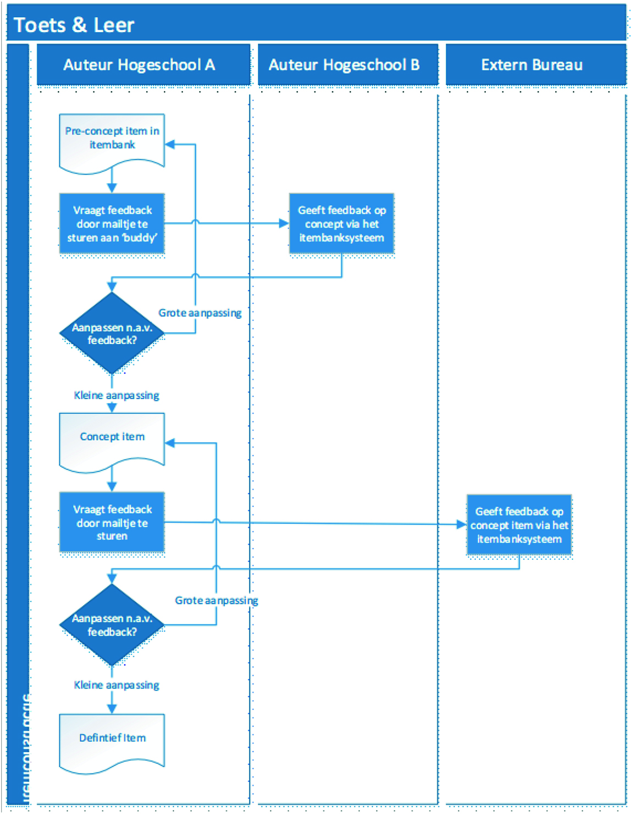
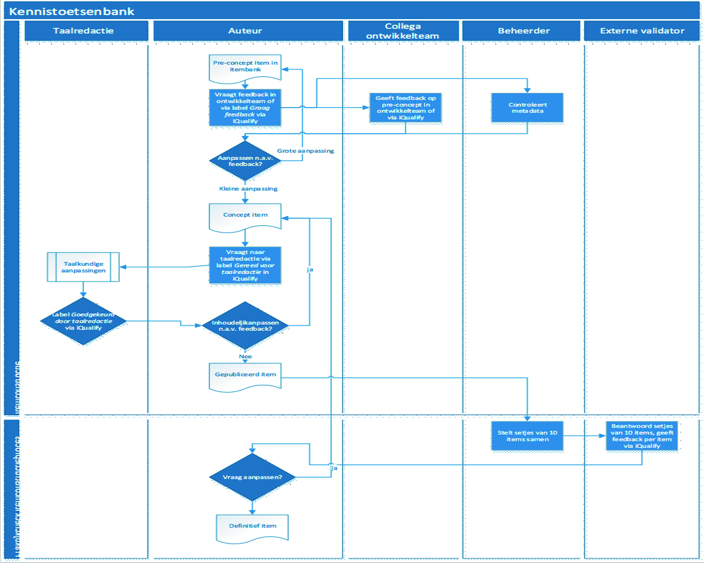

# Bijlagen

## Begrippenkader

### Adaptieve toets  
Een toets waarbij de kandidaten gemakkelijker of moeilijker opgaven moeten beantwoorden afhankelijk van de vaardigheid van de kandidaat, die wordt ingeschat op basis van voorgaand items.

Bij een op IRT gebaseerde adaptieve toets is sprake van gekalibreerde items waarvan die op een gegeven vaardigheidsniveau van de kandidaten het meest nauwkeurig kunnen meten. Bij een computer-adaptieve toets worden geen items meer aan de kandidaat aangeboden als het niveau van vaardigheid met de gewenste nauwkeurigheid is vastgesteld. Zie ook: item response.

### Afspeelomgeving  
De component van een toetssysteem waarmee toetsen en items aan de kandidaten worden aangeboden en de antwoorden geregistreerd worden.  

*    zorgt dat studenten na inloggen de toets kunnen maken;
*    wordt vaak gecombineerd met een zogenaamde secure browser, die ervoor zorgt dat de student niet ongeoorloofd software kan gebruiken om op internet te zoeken, met derden te communiceren, etc.;
*    registreert de antwoorden en stuurt deze terug naar de itembank.

### Auteursomgeving  
De component van een toetssysteem waarmee items kunnen worden ingevoerd.

*    is een interface waarin items kunnen worden ontwikkeld en voorzien van metadata;
*    biedt keuze uit allerlei vraagtypen (meerkeuze, aanwijsvraag, open vraag, etc.);
*    geeft de mogelijkheid multimediale componenten op te nemen;
*    ondersteunt (meestal) de workflow en legt het reviewproces vast;
*    ondersteunt het reviseren van items (bijvoorbeeld na de eerste toetsafname)

### Betrouwbaarheid  
De mate waarin de score op een toets niet van het toeval afhankelijk is. De mate waarin een toets bij gelijke condities dezelfde uitslag oplevert. In statische termen wordt betrouwbaarheid beschreven in de mate waarin een meting vrij is van meetfouten (ook wel ruis of error genoemd).
Zie ook: Misclassificaties.

### Body of Knowledge (BoK)  
Een Body of Knowledge (BoK) is een gemeenschappelijke kennisbasis voor een vakgebied of sector waaraan de professional zijn theoretische en praktische kennis, inzichten en methoden ontleent. Het gaat niet alleen om theorie, maar ook om beproefde inzichten en methoden van de beroepsgroep in kwestie.

### Businesscase  
Een businesscase of een haalbaarheidsstudie beschrijft de afweging om een project of taak te beginnen of te stoppen. In de business- case worden de kosten tegen de baten afgewogen, rekening houdend met de risico’s. Een businesscase is niet bedoeld om uitsluitend een financiële afweging te maken. Juist ook kwalitatieve overwegingen worden in een goede businesscase nadrukkelijk in
de beoordeling betrokken. Een aspect als kwaliteitsverbetering kan voor een instelling heel belangrijk zijn, terwijl het zuiver financiële gewin daarvan nauwelijks te bepalen is.
Bekijk ook de **[whitepaper De businesscase van digitaal toetsen](https://www.surf.nl/kennisbank/2014/whitepaper-de-businesscase- van-digitaal-toetsen.html)**.

### Cronbach's alpha  
Een psychometrische maat die bij een niet-herhaalde toets (dus éénmalige afname zoals een tentamen) een waarde geeft waarin de meting onderhevig is aan meetfouten. Cronbach's alpha is geschikt voor polytoom gescoorde items. Vragen waar naast correct-incorrect (0 of 1) ook met bijvoorbeeld 0, 1, 2, 3 etc. punten kan worden gerekend. Zie ook: KR20. 

### Diagnostische toetsen (onderdeel van formatieve toetsen)  
Een formatieve toets waarbij een kandidaat inzicht krijgt in zijn progressie door de leerstof. Een diagnostische toets is representatief voor wat betreft inhoud en niveau met een eventueel volgende summatieve eindtoets. Zie ook: Oefentoets.

### Digitaal toetssysteem  
Dit is het cyclische proces om van leerdoelen, via items, toetsen, afname en analyse toetsing te realiseren en voortdurend te verbeteren. Vaak wordt in het centrum van deze cyclus de ontwikkeling en beheer van de itembank gesitueerd.

```{r, echo=FALSE, fig.cap="Componenten van digitale toetssystemen afgebeeld op de toetscyclus.", out.width="40%"}
knitr::include_graphics("images/ToetsCyclus.svg")
```

### Formatieve feedback  
Feedback waarbij de opbrengst voor het leerproces voorop staat. De feedback is bedoeld om studenten te stimuleren om zich verder te verdiepen in de stof. Bij incorrecte antwoorden worden vaak aan wijzingen gegeven om het correct antwoord te kunnen achterhalen of simpelweg het correcte antwoord. Bij correcte antwoorden wordt soms verdiepende stof of een ander voorbeeld besproken.

### Formatieve toetsing  
Toetsing waarbij het leren van de toets voorop staat. Vanuit de literatuur wordt hierbij aanbevolen om af te zien van het geven van cijfers . Door met toetsopgaven aan de slag te gaan en te leren van fouten en feedback wordt het leerproces gestimuleerd. Er wordt niet gestreefd naar een bepaald minimaal te behalen niveau. Soms ook aangeduid met Assessment for Learning of Assessment as Learning.

### Geparametriseerde vraag  
Een item bestaand uit een vaste hoofdstructuur met variabele elementen (getallen, objecten, concepten, principes), zodat ze elke keer een nieuw item vormen. Sommige itembanksystemen genereren elke keer een uniek nieuw item voor de docent of een unieke set van waarden voor elke student.

### IMS  
Een IMS-standaard is vastgelegd door het IMS Global Learning Consortium, een community van hogeronderwijsinstellingen, leveranciers en overheidsinstellingen die samen uitwisselingsstandaarden ontwikkelen. Toen IMS in 1997 begon was de officiële naam Instructional Management Systems (IMS)-project.

### Item-response theorie (IRT)  
Item-response theorie (IRT) is een methode waarbij er vanuit wordt gegaan dat de kans dat een kandidaat een item correct beantwoordt bepaald wordt door de vaardigheid van de kandidaat als functie van het moeilijkheidsniveau van het item en het onderscheidend vermogen van het item. IRT is een theorie die uitgaat van de karakteristiek van items, terwijl de klassieke testtheorie uitgaat van de karakteristiek van een toets. Om IRT zinvol te kunnen toepassen moet op basis van een groot aantal toetsafnames bij een populatie waarin alle vaardigheidsniveaus aanwezig zijn deze karakteristieken voorafgaand aan een toets worden bepaald (zgn. kalbireren). Zie ook: adaptieve toets.

### Item  
Een opdracht/taak waarop een kandidaat het correcte antwoord moet geven. Wordt ook wel aangeduid als vraag, toetsvraag of toetsitem.

### Itembank  
Een verzameling van items voor een bepaald toetsdoel. Een itembank heeft daarvoor een bepaalde ordening, meestal op basis van metadata en in de vorm van een metadata en in de vorm van een hiërarchische structuur.

### Itembanksysteem  
Een software om itembanken in op te kunnen slaan en bewerken. Itembanksystemen kunnen losse systemen zijn of onderdeel van een toetssysteem. In een toetssysteem zijn ook functies opgenomen om toetsen samen te stellen, toetsen af te nemen, toetsen te scoren en toetsanalyses uit te voeren.

### Klassieke testtheorie  
De klassieke testtheorie (KTT) heeft als basisaanname dat de geobserveerde score op een toets bestaat uit de werkelijke score plus een meetfout. Uitgaande van deze basisveronderstellingen kunnen grootheden zoals Cronbach's alpha worden berekend, die een schatting is voor de grootte van de meetfout.

### KR20  
Een psychometrische maat die bij een niet herhaalde toets (dus éénmalige afname zoals een tentamen) een waarde geeft waarin de meting onderhavig is aan meetfouten. Het enige verschil tussen KR20 en Cronbachs alfa is dat er bij KR20 uitsluitend met dichotoom gescoorde items kan worden gerekend, zoals meerkeuzevragen. Dus items die correct of incorrect zijn en 0 of 1 punt opleveren. Zie ook: Cronbachs alfa.

### Learning analytics  
Learning analytics is het verzamelen en analyseren van studiedata die een student tijdens het online leren genereert. De studiedata worden omgezet naar waardevolle informatie en kan bijdragen aan de verbetering van de onderwijskwaliteit. Zie ook: https://www.surf.nl/onderwijs-ict/learning-analytics. 

### LTI  
LTI (Learning Tools Interoperability standard) is een IMS-standaard om toetssystemen te koppelen aan andere systemen zoals digitale leeromgevingen (LMSen zoals Blackboard of Canvas). Daarbij worden docent- en studentgegevens tussen de systemen automatisch uitgewisseld, kunnen toetsen vanuit de LMS worden gestart en worden de scores op toetsen teruggevoerd naar de cijferlijstfuncties in de LMS. Zie ook: SCORM.

### Meetfout  
De meetfout bij een toets is de afwijking van de score op een toets die niet verklaard kan worden. De werkelijke score is de geobserveerde score minus de meetfout. Zie ook: ruis en error.

### Metadata  
Toegevoegde gegevens aan items die aanvullende karakeristieken beschrijven. Die gegevens kunnen gebruikt worden om de items te structureren (zie structuur), zoeken, filteren en selecteren.

### Misclassificaties  
Het aandeel kandidaten dat onterecht gezakt danwel geslaagd is op een toets. Toetsen met lage betrouwbaarheid hebben een hoge mate van misclassificaties. Zie ook: betrouwbaarheid.

### Oefentoetsen (onderdeel van formatieve toetsen)  
Een toets waarbij een kandidaat kan oefenen met de leerstof. De kandidaat kan zelf onderwerpen en niveau kiezen. Vaak worden deze toetsen gebruikt om vooral met moeilijke begrippen of concepten te oefenen. Soms wordt enige adaptiviteit ingebouwd zodat de afspeelomgeving items op een best passend niveau wordt aangeboden aan de kandidaat. Zie ook: diagnostische toets.

### Psychometrische data  
Psychometrische data betreft de te berekenen gegevens van afgenomen toetsen en items die iets zeggen over de kwaliteit van de toetsing. Enerzijds zeggen zij iets over de betrouwbaarheid en moeilijkheidsgraad van toetsen als geheel. Anderzijds zeggen ze iets over het discriminerend vermogen en de moeilijkheidsgraad van afzonderlijke items uit die toetsen. Zie ook: klassieke testtheorie, item-response theorie, Cronbach's alpha, p-waarde, rit-waarde.

### P-waarde  
De proportie van de kandidaten die een item correct heeft beantwoord. Wordt ook de moeilijkheidsgraad van een item genoemd. Hoe hoger de p-waarde, des te gemakkelijker is het item. P-waarde wordt alleen gebruik in relatie tot de klassieke testtheorie.

### QTI  
QTI (Question and Test Interoperability) is een IMS-standaard voor de uitwisseling van items en toetsen tussen toetssystemen.

### Rit-waarde  
De correlatie tussen de score van de kandidaten op de item en de score op de toets als geheel minus de betreffende item zelf. De rir-waarde is een wat strengere maat voor het discriminerend vermogen dan de rit-waarde omdat bij de rir-waarde de invloed van het item zelf op het discriminerend vermogen wordt uitgesloten. Rir-waarde wordt alleen gebruik in relatie tot de klassieke testtheorie. Zie ook: Rit-waarde en klassieke testtheorie.

### SCORM  
SCORM (Sharable Content Object Reference Model) is een IMS-standaard om toetssystemen te koppelen aan andere systemen zoals digitale leeromgevingen (LMSen zoals Blackboard of Canvas). Daarbij worden met name docent- en studentgegevens tussen de systemen automatisch uitgewisseld, kunnen toetsen vanuit de LMS worden gestart en worden de scores op toetsen teruggevoerd naar de cijferlijstfuncties in de LMS. Zie ook: LTI.

### Stabiel domein  
Een vakgebied dat weinig veranderingen meer ondergaat. Zie ook: volatiel domein.

### Structuur  
De manier waarop een verzameling van items logisch geordend zijn, bijvoorbeeld in een boomstructuur.

### Summatieve toetsing  
Toetsing waarbij het zo nauwkeurig mogelijk meten van een bepaald niveau van vaardigheid voorop staat. De behaalde score op een dergelijke meting wordt gebruikt voor formele toerekening van een behaald studieresultaat zoals studiepunten of een diploma. Denk bijvoorbeeld aan examens of een tentamen. Soms ook aangeduid met assessment of learning.

### Toetsitem  
Zie: item.

### Toetstransparantie  
Het geheel van aspecten rondom toetsing dat de mate van transparantie, betrouwbaarheid en validiteit van toetsing behelst. Transparantie kan bijvoorbeeld toenemen als inzicht is in de wijze waarop items worden gemaakt, betrouwbaarheid kan toenemen als items beter onderscheid maken tussen studenten met verschillende mate van beheersing van de stof of vaardigheid,
validiteit kan toenemen als de items beter en vollediger de beoogde kennis of vaardigheid meten.

### Toetsmatrijs  
Een toetsmatrijs is een overzicht hoe toetsopgaven in een toets verdeeld zijn over de stof. Vaak wordt per onderdeel van de stof tevens de gewenste type vaardigheid, zoals kennis, inzicht of toepassing, aangegeven. Soms ook aangeduid als toetsmatrix, toetplan, specificatietabel of blueprint.

### Toetsveiligheid  
De mate waarin correcte antwoorden items en toetsen niet op een ongeoorloofde manier door kandidaten gegeven worden (fraude). Bijvoorbeeld doordat items zijn gestolen of in het publieke domein terecht zijn gekomen, danwel dat kandidaten tijdens de toetsafn ame de beschikking hebben over ongeoorloofde bronnen, danwel dat kandidaten toetsuitslagen kunnen wijzigen. Zie o.a. de SURF uitgave [Handboekveilig toetsen](https://www.surf.nl/werkboek-veilig-toetsen).

### Toetsvraag  
Zie: [item].

### Vakgebied  
Een vakgebied is een terrein van beroepsmatig toegepaste kennis en vaardigheden waar mensen zich in kunnen specialiseren. Voor het uitwisselen van ervaring en vakkennis is meestal een jargon nodig.

### Vragenbank  
Een systeem waarin alle items zijn verzameld.

### Volatiel domein  
Een vakgebied dat aan veel veranderingen onderhevig is door nieuw ontwikkelde kennis, methoden of technieken. Zie ook: stabiel domein.

### Workflow  
Een logische, vastgelegde volgorde van activiteiten die moeten worden uitgevoerd om een van te voren gedefinieerde uitkomst te verkrijgen. Deze stappen kunnen sequentieel zijn, maar kunnen ook parallel worden uitgevoerd afhankelijk van doel van het proces.

## Workflows voor itemontwikkeling

In deze bijlage beschrijven we drie praktijkvoorbeelden van workflows voor itemontwikkeling.

### Een itemontwikkelproces door twee docenten  
Een coördinator/examinator van de faculteit Aard- en Levenswetenschappen van de Vrije Universiteit Amsterdam ontwikkelt en onderhoudt een itembank over het onderwerp Microbiologie. Elk jaar worden ongeveer 60 nieuwe items gemaakt.

*    De coördinator is de itembank gestart op basis van de itembank van de uitgeverij McGrawHill: Prescott’s Microbiology. De structuur van de itembank volgt de hoofdstukken uit dat boek. Die itembank wordt door de uitgeverij geleverd in Word formaat. De docent kopieert de inhoud één voor één naar het online itembanksysteem QMLive.
*    Tijdens het invoeren voert de coördinator een kwaliteitscheck uit: ongeveer 80-90 procent van de items zijn relevant en van goede kwaliteit. De rest van de items verwijdert de coördinator.
*    Een nieuw item maakt de docent eerst in MS Word.
*    Een week voor uitvoering van het cursusonderdeel laat de coördinator nieuwe items reviewen door de uitvoerend docent. Reviewen gaat via MS Word.
*    Op basis van de feedback van de uitvoerend docent past de coördinator het item aan. Hij voert het in het itembanksysteem in.
*    Na afloop van de toets en op basis van de psychometrische analyse past de docent een item direct aan in de itembank voor de volgende jaren.

Het kost de docent ongeveer een half uur om een goed item exclusief feedback te ontwikkelen. De coördinator maakt vooral andere vraagtypes dan meerkeuzevragen, vaak met afbeeldingen. Dat kost relatief veel tijd per item.

```{r, echo=FALSE, fig.cap="Itembank workflow 1.", out.width="60%"}
knitr::include_graphics("images/microbio.jpg")
```

### Itemontwikkelproces samenwerking tussen hogescholen  
Toets & Leer was een samenwerkingsverband van zes hogescholen (2012 – 2018) met itembanken voor de onderwerpen Bedrijfsadministratie/boekhouden, Bedrijfseconomie, Belas- tingrecht, Marketing, Management en Recht.

De hogescholen leverden docenten voor de itemontwikkeling. Ze werkten met gesloten beurzen. Op jaarbasis leverden ze 300 per hogeschool. Het werkproces zag er als volgt uit: 

*    Een docent ontwikkelt een item en voert dit in het itembanksysteem in. De docent informeert een docent-collega van één van de andere hogescholen, meestal per groepje van items.
*    De collega-docent controleert de items en zorgt voor eventuele wijzigingen en aanvullingen. Aanvullingen en opmerkingen worden in de toetsapplicatie opgeslagen. De collega-docent bericht de oorspronkelijke auteur en deze controleert de wijzigingen.
*    Het item wordt toetstechnisch gecontroleerd door een extern bureau. Eventueel ontvangt de oorspronkelijke auteur een opmerking of een verzoek tot wijziging. Dan volgt hernieuwde controle.
*    Het item in de toetsapplicatie wordt definitief goedgekeurd.
*    Op incidentele basis vindt terugkoppeling plaats op basis van een psychometrische analyse.
Idealiter is er een redacteur ingevoegd in het proces. Het kostte in dit geval gemiddeld ongeveer een half uur om een goed item inclusief feedback te ontwikkelen. De meeste items waren meerkeuzevragen (ongeveer 80 procent) en invulvragen (korte tekst of getal, ongeveer 20 procent).

```{r, echo=FALSE, fig.cap="Itembank workflow 2.", out.width="60%"}

```

### Itemontwikkelproces MBO Kennistoetsenbank  

De betrokken mbo’s leveren docenten voor de itemontwikkeling. Itemontwikkelaars worden betaald voor vier uur itemontwikkeling per week. Per itembank zijn ongeveer zes tot tien itemontwikkelaars actief. 

*    De itemontwikkelaars construeren in een team pre-concept-items met feedback, geordend naar zowel het kwalificatie-dossier als de Body of Knowledge (BoK). Deze pre-concept-items gaan meerdere keren langs meerdere docenten (interne validatie). Labels aan items maken duidelijk welke items nog moeten worden bekeken (metatags). Aanvullingen en commentaar worden bijgehouden in het itembanksysteem.
*    Er vinden maandelijkse face-to-face werksessies met toetsdeskundigen en docenten van de deelnemende mbo’s plaats. Tijdens die sessies bespreken de teams nieuwe items per kwalificatiedossier. Hieruit ontstaan concept-items.
*    De itemontwikkelaar past de concept-items zo nodig aan. Hieruit ontstaan gepubliceerde items. Vóór publicatie vindt taalredactie plaats.
*    Het aanpassen is een continu proces. Gebruikers kunnen opmerkingen plaatsen bij items die tot aanpassingen kunnen leiden. Bij grote aanpassingen is het mogelijk om opnieuw interne en externe validatie toe te passen.
*    In het itembankproject vindt alleen op incidentele basis terugkoppeling plaats op basis van een psychometrische analyse.

Het kost gemiddeld ongeveer 1 uur om een goed item inclusief feedback te ontwikkelen.

```{r, echo=FALSE, fig.cap="Itembank workflow 3.", out.width="60%"}

```