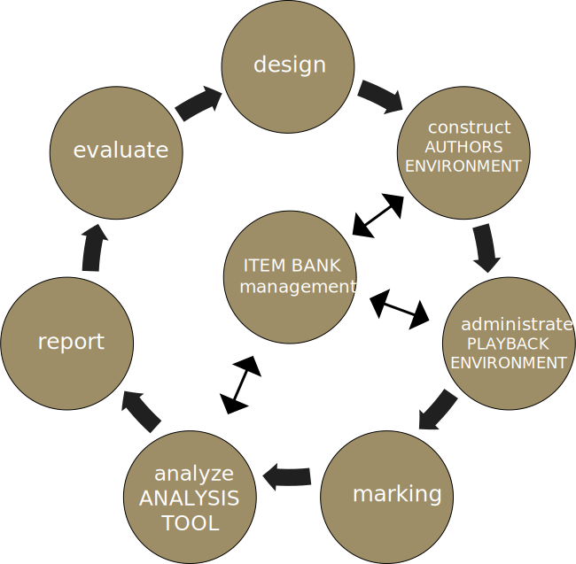

--- 
title: "Handbook Item Banking"
subtitle: "An itembank in 5 steps"
author: ["SURF,", "Versnellingsplan"]
date: "Updated: `r Sys.Date()`"
site: bookdown::bookdown_site
output: bookdown::gitbook
documentclass: book
# bibliography: [book.bib, packages.bib]
# biblio-style: apalike
# link-citations: yes
github-repo: Werkgroep-Toetsen-Op-Afstand/Handbook-Item-Banking
description: ""
always_allow_html: true
bibliography: "bibliography.bib"
biblio-style: "apalike"
link-citations: true
---

# Introduction

## Introduction 
Digital item banks are a wonderful tool for increasing the quality of assessments and helping reduce costs. Developing exam questions together means coordinating objectives and processes. More expertise and time will be available per item (exam question) for development and quality assurance. Taken together, this will improve the quality of the assessment. Reusing items can help reduce costs. 

The coronavirus crisis has also shown that item banks play a role in situations where online assessment creates risk exposure. In particular, if test questions leak out or students conspire while sitting an exam. Item banks offer the opportunity to reduce these risks. 

The development, management and maintenance of item banks require good project management. The aim of this publication is to show you how to set up a digital system to share items with colleagues inside and outside the institution. This handbook combines the knowledge and expertise that institutions, institutional partnerships and SURF have acquired on this topic. It helps institutions wanting to take advantage of digital item banks to get started. The handbook consists of an introduction, a step-by-step plan and an in-depth section. 

### Who is this publication for? 
The handbook is intended for anyone who plays a role in the processes surrounding the development, management and maintenance of an item bank and the items in it.  
For example:  

* Lecturers who want to organise their test items better or who want to develop them or share them with a colleague 
* Educational advisers who support lecturers or who are the pacemakers behind the creation of an item bank 
* A collaborative venture wanting to share assessment resources or deploy assessments together 
* A national consultation aimed at increasing the quality of assessment 
* Functional administrators of an assessment system used for an item bank  

### Scope 
The handbook focuses on the development, management and use of item banks within a study programme, within a single institution, across institutions, within a certain domain or even nationally. The essential premise is that the processes will be the same. The handbook does not provide a comprehensive description of existing item banks or testing systems. This is available in the SURF thematic publication [Theme edition: Testing and question banks in education](https://www.surf.nl/en/theme-edition-testing-and-question-banks-in-education).  

The development of item banks can form part of a larger digital assessment implementation process within an institution. For the implementation of digital assessment, we refer to a number of SURF publications, such as the [Guidelines for digital assessment policy](https://www.surf.nl/en/guidelines-for-digital-assessment-policy), the [Getting started with digital testing policy in 5 steps](https://www.surf.nl/en/getting-started-with-digital-testing-policy-in-5-steps) and the [Secure assessment workbook: Tools and tips for setting up a secure assessment process](https://www.surf.nl/en/secure-assessment-workbook-tools-and-tips-for-setting-up-a-secure-assessment-process).  

This handbook is based on the assessment cycle described in the [Begrippenkader voor digitaal toetsen van SURF uit 2013](link). The focus is on developing items (the item development process) and managing items in an item bank. The foundation for sound assessment is a good item bank. Other sources are available on how to develop sound exams within an assessment system based on an item bank, such as Toetsen in het hoger onderwijs by @van2017toetsen.

### Justification
This edition is an updated version of the 2018 edition. The Digital Assessment Special Interest Group (SIG) has critically reviewed, supplemented and updated the publication, partly in the light of experiences gained during the coronavirus crisis of 2020-2021.  The original publication was produced in close cooperation with item bank experts from various institutions, the Digital Assessment SIG, Cito, 10voordeLeraar and Prove2Move. This handbook is based on the experiences of the experts involved in developing item banks. We also used collected resources from SURF and available literature on this topic.  

See the publication details for a list of all those involved who contributed to this handbook. Please feel free to contact the authors and/or the experts who contributed to the handbook for more information.  

## Definitions and concepts
A good understanding of a number of concepts is essential for the use of this handbook. We briefly describe the components of a digital assessment system and show how they relate to the item bank.  

### What is an item bank?
An item bank is a collection of items or questions (throughout this handbook, we will call them items). An item bank system is a digital system used to store and manage collections of items. An item bank system may contain multiple item banks. When we refer to item banks in this handbook, we actually mean the item bank system (the digital item bank).  

::: {.tip}

**Definition**  

An **item bank** is a collection of items for a particular assessment objective. An item bank has a certain structure, usually hierarchical and based on metadata.  
An **item bank system** is a digital system used to store and manage collections of items. An item bank system may contain multiple item banks.  

:::

The questions are structured in the item bank according to a certain logic. Version management is used, and all kinds of metadata can be stored about the content, the question type, the level and other characteristics. You can also store psychometric data, such as the degree of difficulty and the discriminatory capacity of specific items. Sometimes the programmes of an item bank system will run locally on a single computer. Other item banks are deployed in web-based environments. The database and the application are accessed using cloud technology. Multiple users can work in a cloud-based system at the same time.  

::: {.tip}

**Useful information**  
**Why are 'test questions' often referred to as items by assessment experts?**  
In the 1930s, standardised tests and rudimentary databases of questions were starting to be used in the United States. Soon, a professional group emerged which developed its own associated professional terminology. 'Test questions' became 'test items'. In the Netherlands, we have now adopted the same phraseology.  

:::


### The position of an item bank within the digital assessment system
When we refer to a digital assessment system, we mean the software that facilitates the digital assessment process. We can distinguish between a number of core components: authoring environment, item bank, playback environment and analysis tool. We will discuss these components based on the assessment cycle. Not all steps in the assessment cycle are supported by digital assessment systems. Figure \@ref(fig:toetscyclus) shows how the components of a digital test system fit in with the assessment cycle.  

```{r toetscyclus, echo=FALSE, fig.cap="Components of digital assessment systems depicted in the assessment cycle.", out.width="60%"}

```

The **item bank** is the central component in which the individual items are stored. The editing and playback of the items take place in other systems, which then return the results to the item bank. The item bank plays a role in the following components of the assessment cycle:  

The **design** of the test (also known as the test specification) relates to aspects such as the purpose of the test, the components to be assessed, the choice of formative or summative assessment and the ‘assessment method’. This means that no items are yet created in the design.  

A test is compiled using a collection of items. A specification table is usually used, commonly also known as the test matrix or test blueprint. This specifies how many items, what types of questions and what subjects of which method, knowledge or application will be included in the test.  

The **development** (construction) of the items is performed in the assessment system's authoring environment. In the case of closed questions, the answers will be included; sample answers may sometimes also be included for open questions.  

Assessment software offers a playback environment for online **test administration**. The playback environment checks the student's identity by means of a login procedure, presents the student with a test and stores the student's answers.  

The **marking** of the test will depend on the selected question types. Answers to closed questions are usually assessed and scored without human intervention. The item developer (the lecturer) will have included the correct answer in advance. Open questions must be marked, with systems allowing, for example, ‘blind’ marking and ‘question-by-question’ marking, possibly aided by supporting software.  

Some software packages included an analysis tool to perform a **test analysis**, but analysis can also be performed after downloading the data file and preparing it in Excel or SPSS, for example. Test analysis is often used to help determine the reliability of tests and to pinpoint items that are of dubious quality.  

### Key concepts
**Formative assessment**: Testing in which the learning that comes from taking the test is of primary importance, usually ungraded, but often with feedback on each test question or test. The learning process benefits from taking test assignments and learning from your mistakes. There is no set minimum level that needs to be achieved.  

**Psychometric data**: This data tells us about the degree of difficulty of questions and the extent to which a student has internalised the subject matter. Psychometric data can be stored in the item bank along with the item the data relates to.  

**Summative assessment**:  Testing that focuses on measuring a certain level of competence as accurately as possible. The score obtained is used for a formal award based on study performance, such as study credits or a diploma.  

**Assessment quality**: The entirety of aspects relating to assessment including the degree of transparency, reliability and validity of the assessment. For instance, transparency increases when insight is available into how items are created. Reliability increases, for example, when items discriminate more clearly between students with differing degrees of mastery of the subject matter or competence. Validity increases when the items are better at measuring the intended knowledge or competence more completely.  

::: {.tip} 

**Collaborative partnerships**  
In this handbook, we refer to a number of cross-institutional item banks in use in the Netherlands. We are grateful that we have been able to make use of their knowledge and experience. The collaborative partnerships consulted are as follows:  

**[deKennistoetsenbank MBO <i class="fas fa-external-link-alt"></i>](https://www.prove2move.nl/dekennistoetsenbank/)**  
For the vocational education and training (VET) programme profiles in Care and Welfare, Social Work and Nursing/Individual Care, the kennistoetsenbank MBO of Prove2Move provided item banks containing thousands of items each. Kennistoetsenbank MBO is a cross-curriculum digital system that supports learning by providing robust knowledge-testing questions. Prove2move is a cooperative venture of the three regional learning providers (Landstede, Deltion College and ROC Twente).   

**[IVTG <i class="fas fa-external-link-alt"></i>](https://www.ivtg.nl)**  
The Interuniversity Progress Test for Medicine (iVTG) is a benchmarking instrument used to provide metrics on the knowledge progression of medical students during their studies. This is an inter-university partnership consisting of six academic teaching hospitals.

**[10voordeleraar <i class="fas fa-external-link-alt"></i>](https://www.10voordeleraar.nl)**
The 10voordeLeraar programme was developed under the auspices of the Association of Universities of Applied Sciences (Vereniging Hogescholen) and offers national knowledge bases, mandatory knowledge tests and a peer review system for all teacher training programmes. 

**[Sharestats <i class="fas fa-external-link-alt"></i>](https://www.sharestats.nl)**  
The aim of this project is to provide a freely accessible, comprehensive collection of learning resources on statistics. By adding metadata to the learning resources, lecturers from the professional community can determine and use a selection of statistics for their own teaching practice, as and when required. The five partners of the project team (UvA Psychology and UvA Pedagogical and Educational Sciences, VU Social Sciences (FSW), VU Behavioural and Movement Sciences (FGB), UU Social Sciences and EUR Psychology/Pedagogy) form the core of the professional community.  

:::

## An item bank in 5 easy steps
In practice, item banks can sometimes emerge without any deliberate plan. A small-scale trial grows into something big. An approach like this entails the risk of item bank development stagnating at a later stage, for example, due to a lack of time or as a result of personnel changes. The advice here is think things though before starting out. Plan your work and pace yourself. Racing ahead may come back to bite you later, with consequences for support or even resulting in project failure.  

We have identified five steps in the development and use of an item bank. Within each step, there are a number of things you need to arrange. These things will sometimes require attention at the same time, or in a different order than that described here. The result you are aiming for – a working item bank – will be further fleshed out during each step, working from the bare bones to the finished product.  

Part 2 of the handbook, the Step-by-Step Plan, guides you through the various steps. Sometimes, you will need to have certain theoretical knowledge, and for this reason we regularly refer to part 3 of the Handbook, the Going Deeper section. This section contains more background information about setting up an item bank.  

::: {.tip}

**Tip**  
If you're short on time to study the entire Handbook, be sure to keep the success factors for developing, managing and using an item bank from Chapter 4 on hand.  

:::

### Step-by-Step Plan  

::: {.stappenplan}

1. <div class="nr stap">1</div> <div class="stap">Preparation</div>
    + Formulate the objective and investigate the feasibility of the item bank.  
    + Familiarise yourself with assessment systems and the compatibility of the various system.  
    + Deepen your knowledge in terms of scale and question reproduction.  
    + Make an initial cost and benefit analysis.  
2. <div class="nr stap">2</div> <div class="stap">Plan</div>
    * Create an action plan that describes:  
    * the purpose;  
    * the outcome (what will you have achieved by the end of the process?);  
    * how you intend to achieve this.  
3. <div class="nr stap">3</div> <div class="stap">Design</div>
    * Organise the questions.  
    * Organise the steps in the procedure and assign roles and privileges.
    * Decide on quality requirements and check whether the system meets them.  
    * Choose an assessment system.  
    * Record any arrangements you agree regarding scale and question production.  
    * Arrange the financial aspects.  
    * Make arrangements to give the project a legal foundation.  
    * Organise administration of the item bank.  
4. <div class="nr stap">4</div> <div class="stap">Pilot</div>
    * Develop the items.  
    * Set up the item bank and try it out.  
5. <div class="nr stap">5</div> <div class="stap">Real-life deployment</div>
    * Start using the item bank.  
    * Make the item bank future-proof.  
    
:::

## Success factors  
Developing and using an item bank can be complex. The success factors below can help make an important contribution to the viability of an item bank. Be sure to give them due consideration, even when the collaboration is relatively straightforward. These factors run like a thread through the Handbook. 

:::{.bullets_spaced}

1. Think things though before starting out: take the time at the start, estimate the feasibility as well as you can, and try to find the balance between a project-based approach and allowing things to emerge organically. Choose a method that suits your situation. 
2. Designate a project initiator and ensure that ownership is assigned correctly from the outset. Without a project initiator or arrangements relating to ownership, the risk of failure will be high. 
3. To develop the item bank, decide on what steps you want to go through and what results you want to achieve at each step. 
4. Decide on the purpose of your item bank and assign a clear role to it in the teaching practice. Stick to this plan. Communicate this vision on a regular basis. 
5. Be realistic and manage expectations: the perfect item bank will not be created overnight; in fact, it may never be perfect. Perfecting the item bank will not be a desktop exercise. Dare to try out different things. 
6. Look around you, and you'll see that a lot has already been developed. There is no need to reinvent the wheel. Get experts involved. 
7. Support is essential. 
    * Lecturers who know and trust each other and who support the purpose of the item bank are a prerequisite for success; devote energy in getting to know each other.
    * Put proper guidance and support in place for lecturers. 
    * The existence of a network of people already working together and sharing knowledge will significantly increase the chances of success. 
8. Start out small and try out different set-ups and metadata options. Continue to make adjustments until you find the correct set-up and method. Keep it simple and ensure it is aligned closely with daily practice. 
9. Do not underestimate the nature and extent of the work and/or the project. It is difficult material to get your head around. Changing people's behaviour as well as their working methods will be no mean feat. 
10. Be aware of technical limitations when developing an item bank across institutional boundaries. 

::::